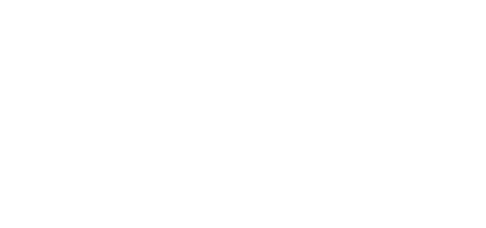

```{=html}
<script>
   $(document).ready(function() {
     $head = $('#header');
     $head.prepend('')
   });
</script>

<style>

.header-panel  {
    background-color: #04346c;
}

.nav-tabs{
  background-color:#04346c9e;
}

.nav-tabs > li > a{
  background-color: #04346c9e !important;
    <!-- border: medium none; -->
    <!-- border-radius: 0; -->
    <!-- color:#fff; -->
}

.pages .nav-tabs>li.active>a {
background-color: #04346c !important;
}

</style>
```

```{r, echo=FALSE,message=FALSE,warning=FALSE}
if(require(tidyverse)   == FALSE){install.packages("tidyverse");library(tidyverse)}  else{library(tidyverse)}
if(require(lubridate)   == FALSE){install.packages("lubridate");library(lubridate)}  else{library(lubridate)}
if(require(data.table)  == FALSE){install.packages("data.table");library(data.table)}else{library(data.table)}
if(require(DT)          == FALSE){install.packages("DT");library(DT)}                else{library(DT)}
if(require(dplyr)       == FALSE){install.packages("dplyr");library(dplyr)}          else{library(dplyr)}
if(require(openxlsx)    == FALSE){install.packages("openxlsx");library(openxlsx)}    else{library(openxlsx)}
if(require(highcharter) == FALSE){install.packages("highcharter");library(highcharter)}else{library(highcharter)}
if(require(ggraph)      == FALSE){install.packages("ggraph");library(ggraph)}else{library(ggraph)}
if(require(wordcloud2)  == FALSE){install.packages("wordcloud2");library(wordcloud2)}else{library(wordcloud2)}
if(require(tm)          == FALSE){install.packages("tm");library(tm)}else{library(tm)}
if(require(igraph)      == FALSE){install.packages("igraph");library(igraph)}else{library(igraph)}
if(require(tidytext)    == FALSE){install.packages("tidytext");library(tidytext)}else{library(tidytext)}

`%notin%` <- Negate(`%in%`)
options(scipen = 999)
cols <- c("#4285F4",'#34A853','#FBBC05','#EA4335','#AEB0AD','#9C0ADB')

knitr::opts_chunk$set(warning = FALSE,
                      message = FALSE,
                      fig.width=10,
                      echo = FALSE) 
```

```{r limpieza de datos}
# # Minería (>300)
# c('Minería')
# 
# # Alimentos (102)
# c('Alimentos')

# Tecnología (268)
Tecnología <- c('Informática / Tecnología', 'Telecomunicaciones','Tecnologías de Información',
  'Ingeniería','Tecnologías de Información','Electrónica de Consumo')

# Construcción/Industrial/Automotriz (>300)
`Construcción/Industrial/Automotriz` <- c('Energía / Electricidad / Electrónica','Maquinaria y Equipo','Construcción',
  'Industrial','Cemento y Materiales','Automotriz','Petroleo / Gas / Combustibles','Combustibles (Gas / Petróleo)','Agua / Obras Sanitarias')

# Comercio/ Ventas (>300)
`Comercio/Ventas` <- c('Comercio Minorista','Ventas','Grandes Tiendas','Comercial','Retail','Comercio Mayorista','Hipermercados','Consumo masivo')

# Administración (54)
Administración <- c('Poder ejecutivo y administración pública','Administración Pública','Organizaciones sin Fines de
Lucro','Recursos Humanos','Consultoria / Asesoría','Organizaciones sin Fines de Lucro')

# Financiera (210)
Financiera <- c('Banca / Financiera','Servicios Financieros Varios','Inversiones (Soc / Cías / Holding)',
  'Inmobiliaria/Propiedades',  'Seguros / Previsión')

# Otros (238)
Otros <- c('Seguridad','Otra Actividad','Servicios funerarios','Servicios Varios',
  'Educación / Capacitación','Transporte','Logística / Distribución')

# Quimica y salud (159)
`Química y salud` <- c('Química','Servicios de Salud','Medicina / Salud','Farmacéutica')


load('RTarapaca.RData')


Trabajos <- Trabajos %>% 
  mutate(Estudios = case_when(Estudios %in% c("Ingeniería Comercial, Marketing, Industrial, Administración de Empresas o carrera a fin.\nMínimo 2 años de experiencia comprobable en el cargo (Excluyente)\nManejo Excel nivel intermedio\nManejo de personal\nCapacidad de trabajar bajo presión\nLocomoción propia (excluyente)",
                                              "Ingeniería Comercial, Marketing, Industrial, Administración de Empresas o carrera a fin.Mínimo 2 años de experiencia comprobable en el cargo (Excluyente)Manejo Excel nivel intermedioManejo de personalCapacidad de trabajar bajo presiónLocomoción propia (excluyente)",
                                              "Universitaria","Graduado",
                                              "Formación Académica:-Kinesiología con Registro en la Superintendencia de Salud-Registro de Vacunas Anti Hepatitis BExperiencia:-1 año en cargo similarOtros:-Poseer Residencia en Iquique o dentro de la región-Poseer disponibilidad para trabajar en jornada 4x3 en alta montaña-Manejo de excel intermedio para Reportabilidad") ~ 'Universitaria',
                              Estudios %in% c("-1 años","1 año","Desde 1 año",
                                              "Experiencia en el cargo","Experiencia en mantencion idealmente minera y conocimientos en lubricación o área similar",
                                              "1 año de experiencia en ventas en Terreno en Áreas como:\n\nTelecomunicaciones.\nSeguros\nSeguridad\nCementerios Parques\nAfp\nConvenios\nGestor de Ventas en Ruta.",
                                              "1 año de experiencia en ventas en Terreno en Áreas como:Telecomunicaciones.SegurosSeguridadCementerios ParquesAfpConveniosGestor de Ventas en Ruta.",
                                              "-Indispensable experiencia en flebotomía (toma de muestras).",
                                              "-Experiencia en tomas de muestra.\n-Experiencia con PCR.") ~ 'No informa',
                              Estudios %in% c("Básica","Básica") ~ "Básica",
                              Estudios %in% c("Magíster","Postgrado") ~ "Postgrado",
                              Estudios %in% c("Técnico profesional superior") ~ "Técnico profesional superior",
                              Estudios %in% c("Técnico medio/ colegio técnico") ~ "Técnico medio/ colegio técnico",
                              TRUE ~ 'No informa'),
         Jornada = ifelse(str_length(Jornada) >100 | Jornada == "",NA,Jornada),
         Jornada = ifelse(Jornada == "Práctica Profesional","Práctica",Jornada),
         Jornada = ifelse(is.na(Jornada),"No informa",Jornada),
         Comuna = case_when(Comuna %in% c("IquiqueAlto Hospicio\n","Iquique\nAlto Hospicio","IquiqueAlto Hospicio") ~ "Iquique/Alto Hospicio",
                            Comuna %in% c("character(0)","") ~ "No informa",
                            Comuna %in% c("Faena Nueva Victoria","Faena Minera","Nueva Victoria") ~ "Faena Minera",
                            TRUE ~ Comuna),
         CategoriaE = case_when(CategoriaE == "Minería" ~ "Minería",
                                CategoriaE == "Ingeniería" ~ "Ingeniería",
                                TRUE ~ CategoriaE),
         Categoria = case_when(CategoriaE == 'Minería' ~ 'Minería',
                               CategoriaE == 'Alimentos' ~ 'Alimentos',
                               CategoriaE %in% c('Informática / Tecnología', 'Telecomunicaciones','Tecnologías de Información',
                                                  'Ingeniería','Tecnologías de Información','Electrónica de Consumo') ~ 'Tecnología',
                               CategoriaE %in% c('Energía / Electricidad / Electrónica',
                                                  'Maquinaria y Equipo','Construcción',
                                                  'Industrial','Cemento y Materiales','Automotriz',
                                                  'Petroleo / Gas / Combustibles','Combustibles (Gas / Petróleo)',
                                                  'Agua / Obras Sanitarias') ~ 'Construcción/Industrial/Automotriz',
                               CategoriaE %in% c('Comercio Minorista','Ventas','Grandes Tiendas','Comercial','Retail',
                                                  'Comercio Mayorista','Hipermercados','Consumo masivo') ~ 'Comercio/Ventas',
                               CategoriaE %in% c('Poder ejecutivo y administración pública','Administración Pública',
                                                  'Organizaciones sin Fines de Lucro','Recursos Humanos','Consultoria / Asesoría',
                                                  'Organizaciones sin Fines de Lucro') ~ 'Administración',
                               CategoriaE %in% c('Banca / Financiera','Servicios Financieros Varios','Inversiones (Soc / Cías / Holding)',
                                                  'Inmobiliaria/Propiedades',  'Seguros / Previsión') ~ 'Financiera',
                               # (CategoriaE %in% c('Seguridad','Otra Actividad','Servicios funerarios','Servicios Varios',
                               #                    'Educación / Capacitación','Transporte','Logística / Distribución')) ~ 'Otros'),
                               CategoriaE %in% c('Química','Servicios de Salud','Medicina / Salud','Farmacéutica') ~ 'Química y salud')) %>% 
  filter(!is.na(Categoria))

Trabajos$Requisitos <-  Trabajos %>% 
  select(Requisitos) %>%
  apply(MARGIN = 1, function(x){unlist(x) %>% str_c(collapse = " ")})

Trabajos <- Trabajos %>% 
  filter(str_length(Requisitos) > 20)
```

```{r funciones}
## Función de limpieza ====
limpiar_tokenizar <- function(texto){
  # El orden de la limpieza no es arbitrario
  # Se convierte todo el texto a minúsculas
  nuevo_texto <- str_to_lower(texto)
  # Eliminación de páginas web (palabras que empiezan por "http." seguidas 
  # de cualquier cosa que no sea un espacio)
  nuevo_texto <- str_replace_all(nuevo_texto,"http\\S*", "")
  # Eliminación de signos de puntuación
  nuevo_texto <- str_replace_all(nuevo_texto,"[[:punct:]]", " ")
  # Eliminación de números
  # nuevo_texto <- str_replace_all(nuevo_texto,"[[:digit:]]", " ")
  # Eliminación de espacios en blanco múltiples
  nuevo_texto <- str_replace_all(nuevo_texto,"[\\s]+", " ")
  # Tokenización por palabras individuales
  nuevo_texto <- str_split(nuevo_texto, " ")[[1]]
  # Eliminación de tokens con una longitud < 2
  nuevo_texto <- keep(.x = nuevo_texto, .p = function(x){str_length(x) > 1})
  return(nuevo_texto)
}

## Palabras a eliminar =================================================================
lista_stopwords <- {c('a','al','algo','algunas','algunos','ante','antes','como','con','contra','cual','cuando',
                      'de','del','desde','donde','durante','e','el','ella','ellas','ellos','en','entre','era','erais','eran',
                      'eras','eres','es','esa','esas','ese','eso','esos', 'esta','estaba','estabais','estaban','estabas',
                      'estad','estada','estadas','estado','estados','estamos','estando','estar','estaremos','estará','estarán',
                      'estarás','estaré','estaréis','estaría','estaríais','estaríamos','estarían','estarías','estas','este',
                      'estemos','esto','estos','estoy','estuve','estuviera','estuvierais','estuvieran','estuvieras','estuvieron',
                      'estuviese','estuvieseis','estuviesen','estuvieses','estuvimos','estuviste','estuvisteis','estuviéramos',
                      'estuviésemos','estuvo','está','estábamos','estáis','están','estás','esté','estéis','estén','estés','fue',
                      'fuera','fuerais','fueran','fueras','fueron','fuese','fueseis','fuesen','fueses','fui','fuimos','fuiste',
                      'fuisteis','fuéramos','fuésemos','ha','habida','habidas','habido','habidos','habiendo','habremos','habrá',
                      'habrán','habrás','habré','habréis','habría','habríais','habríamos','habrían','habrías','habéis','había',
                      'habíais','habíamos','habían','habías','han','has','hasta','hay','haya','hayamos','hayan','hayas','hayáis',
                      'he','hemos','hube','hubiera','hubierais','hubieran','hubieras','hubieron','hubiese','hubieseis','hubiesen',
                      'hubieses','hubimos','hubiste','hubisteis','hubiéramos','hubiésemos','hubo','la','las','le','les','lo',
                      'los','me','mi','mis','mucho','muchos','muy','más','mí','mía','mías','mío','míos','nada','ni','no','nos',
                      'nosotras','nosotros','nuestra','nuestras','nuestro','nuestros','o','os','otra','otras','otro','otros','para',
                      'pero','poco','por','porque','que','quien','quienes','qué','se','sea','seamos','sean','seas','sentid','sentida',
                      'sentidas','sentido','sentidos','seremos','será','serán','serás','seré','seréis','sería','seríais','seríamos',
                      'serían','serías','seáis','siente','sin','sintiendo','sobre','sois','somos','son','soy','su', 'sus','suya',
                      'suyas','suyo','suyos','sí','también','tanto','te','tendremos','tendrá','tendrán','tendrás','tendré','tendréis',
                      'tendría','tendríais','tendríamos','tendrían','tendrías','tened','tenemos','tenga','tengamos','tengan','tengas',
                      'tengo','tengáis','tenida','tenidas','tenido','tenidos','teniendo','tenéis','tenía','teníais','teníamos',
                      'tenían','tenías','ti','tiene','tienen','tienes','todo','todos','tu','tus','tuve','tuviera','tuvierais','tuvieran',
                      'tuvieras','tuvieron','tuviese','tuvieseis','tuviesen','tuvieses','tuvimos','tuviste','tuvisteis','tuviéramos',
                      'tuviésemos','tuvo','tuya','tuyas','tuyo','tuyos','tú','un','una','uno','unos','vosotras','vosotros','vuestra',
                      'vuestras','vuestro','vuestros','y','ya','yo','él','éramos','fuesen','siendo','sido')}

## Nube de palabras ===================================================================

nube <- function(df){
  Palabras <- df %>% 
    mutate(texto_tokenizado = map(.x = Requisitos, .f = limpiar_tokenizar)) %>%
    select(texto_tokenizado) %>% 
    unnest(cols = c(texto_tokenizado)) %>% 
    rename(token = texto_tokenizado) %>% 
    filter(!(token %in% lista_stopwords)) %>% 
    count(token, sort = TRUE)

   wordcloud2(Palabras, size=2.1, minSize = 1,
              color = 'random-light', backgroundColor = "#457B9D")
}

## Análisis de palabras por n-gram ====================================================

n_gram <- function(df,numero = 15){
  
  set.seed(371541)
  df %>% 
    map_df(.f = str_trim) %>% 
    map_df(.f = function(x) x %>% str_replace_all("á", "a") %>% 
             str_replace_all("é", "e") %>% 
             str_replace_all("í", "i") %>% 
             str_replace_all("ó", "o") %>% 
             str_replace_all("ú", "u")) %>% 
    unnest_tokens(output = palabras,
                  input = Requisitos,
                  to_lower = TRUE,
                  format = "text",
                  token = "ngrams",
                  n = 2) %>% 
    separate(palabras, c("words1","words2"), sep = " ") %>% 
    filter(!words1 %in% lista_stopwords) %>% 
    filter(!words2 %in% lista_stopwords) %>% 
    filter(is.na(words1) == FALSE) %>% 
    filter(is.na(words2) == FALSE) %>% 
    count(words1, words2, sort = TRUE) %>%
    filter(n > numero) %>%
    graph_from_data_frame() %>% 
    ggraph(layout = "fr") +
    geom_edge_link(aes(edge_alpha = n),
                   arrow = arrow(type = "closed", length = unit(.1, "inches")),
                   show.legend = TRUE, color = "#1D3557"
    ) +
    geom_node_point(size = 2, color = "#A8DADC") +
    geom_node_text(aes(label = name), vjust = 1, hjust = 1, color = "#F1FAEE") +
    theme_void() +
    theme(
      panel.background = element_rect(fill = "#457B9D", color = "#457B9D"),
      plot.margin = margin(1, 2, 1, 1, "cm"),
      plot.background = element_rect(
        fill = "#457B9D",
        colour = "#457B9D",
        size = 1
      ),
      legend.title = element_blank()
    )
  
}

```

# Resumen general

El presente reporte es un estudio de 1.873 publicaciones laborales de la región de Tarapacá, empleos publicados entre abril 2021 y diciembre 2021. Entre la información rescatada esta la empresa, categoría del empleo, tipo de cargo, comuna, jornada laboral y requisitos.

## Indice

Se realiza un estudio general de las categoría de los empleos (informaciones generales), ademas, de un estudio de los requisitos por las 8 principales categorías de empleos.

- [Informaciones generales]
- [Construcción/Industrial/Automotriz]
- [Comercio/Ventas]
- [Minería]
- [Tecnología]
- [Financiera]
- [Química y salud]
- [Alimentos]
- [Administración]

```{r}
Trabajos %>% 
  select(Requisitos) %>% 
  nube()
```


# Informaciones generales

Los trabajos se dividen en 8 grandes categorías

- Construcción/Industrial/Automotriz: 395 ofertas
- Comercio/Ventas: 392 ofertas
- Minería: 335 ofertas
- Tecnología: 262 ofertas
- Financiera: 202 ofertas
- Química y salud: 136 ofertas
- Alimentos: 100 ofertas
- Administración: 51 ofertas

En cuanto a los requisitos de estudios, el 21.4% solicita nivel universitario, 20.4% técnico nivel superior y 11.3% técnico nivel medio. El 42.4% no informa sobre los niveles de estudios requeridos para el empleo.

Respecto al tipo de jornada laboral, un 4.5% de las ofertas señalan una modalidad de teletrabajo y un 2.9% modalidad mixta.

- Jornada Completa: 54.6%
- Por Turnos: 20.8%
- En Terreno: 9.2% 
- Teletrabajo: 4.5% 
- Part Time: 4.2% 
- Mixta (teletrabajo + Presencial): 2.9% 
- No informa: 1.1% 
- Media Jornada: 0.9% 
- Práctica: 0.6% 
- Reemplazo: 0.6% 
- Comisionista: 0.5% 

## Estudio requisitos

Por medio de cadenas de Markov, se puede estudiar los prinicpales requisitos en terminos generales de los empleos son:

- Estudios técnicos
- Carrera afín
- Office nivel medio/avanzado
- Experiencia en cargos similares
- Licencia de conducción clase b y d
- Ingeniero civil industrial
- Turnos rotativos 14x14
- Salud compatible con el cargo
- Disponibilidad inmediata
- Disponibilidad para trabajos a gran altura geográfica
- Experiencia con maquinas pesada
- Enseñanza media completa
- Visa definitiva para extranjeros

```{r}
Trabajos %>% 
  select(Requisitos) %>% 
  n_gram(n = 25)
```


# Construcción/Industrial/Automotriz

El siguiente apartado es un estudio de los empleos de las categorías construcción/industrial y automotriz. Las sub-categorias de empleos son:

- Construcción
- Maquinaria y Equipo 
- Automotriz
- Energía / Electricidad / Electrónica
- Industrial
- Agua / Obras Sanitarias
- Combustibles (Gas / Petróleo)
- Cemento y Materiales
- Petroleo / Gas / Combustibles

Donde las jornadas laborales son principalmente por turno y completa

- Jornada Completa: 49.9%
- Por Turnos: 40.3%
- En Terreno: 6.1% 
- No informa: 2.3% 
- Teletrabajo: 0.8% 
- Práctica: 0.5% 
- Mixta (teletrabajo + Presencial): 0.3%

Requisitos de estudios

- No informa 28.9%
- Técnico profesional superior 27.3%
- Universitaria 27.1%
- Técnico medio/ colegio técnico 8.6%
- Básica 7.6%
- Postgrado 0.5%

## Estudio de requisitos

- Residencia en Iquique
- Enseñanza media completa
- Ingeniero civil
- Licencia de conducir clase b
- Disponibilidad de turnos 14x14
- Office nivel superior
- Estudios técnico profesional
- Habilidad con herramientas computacionales

```{r}
Trabajos %>% 
  filter(Categoria == 'Construcción/Industrial/Automotriz') %>% 
  select(Requisitos) %>% 
  n_gram(n = 12)
```

# Comercio/Ventas

El siguiente apartado es un estudio de los empleos de las categorías Comercio y Ventas. Las sub-categorias de empleos son:

- Retail
- Comercial
- Ventas
- Grandes Tiendas
- Consumo masivo
- Hipermercados

Donde las jornadas laborales son principalmente por turno y completa

- Jornada Completa 69.6%
- Part Time 13.8%
- Por Turnos 6.1% 
- Media Jornada 3.6% 
- Teletrabajo 2.3% 
- En Terreno 1.5% 
- Mixta (teletrabajo + Presencial) 1.5% 
- Comisionista 0.8% 
- Práctica 0.5%

Requisitos de estudios

- No informa 60.5%
- Técnico profesional superior 14.3%
- Técnico medio/ colegio técnico 13.5%
- Universitaria 7.1% 
- Básica 4.6%

## Estudio de requisitos

- Excel nivel intermedio
- Disponibilidad inmediata
- Experiencia en cargos similares
- Estudios técnicos profesionales
- Enseñanza media completa

```{r}
Trabajos %>% 
  filter(Categoria == 'Comercio/Ventas') %>% 
  select(Requisitos) %>% 
  n_gram(n = 10)
```


# Minería

El siguiente apartado es un estudio de los empleos de del rubro de la minería. Las jornadas de los empleos del rubro de la minería son:

- Jornada Completa 32.5%
- En Terreno 30.7%
- Por Turnos 28.1%
- No informa 2.4% 
- Teletrabajo 2.1% 
- Práctica 1.8% 
- Reemplazo 1.5% 
- Mixta (teletrabajo + Presencial) 0.9%

Requisitos de estudios

- No informa 40.3%
- Universitaria 27.2%
- Técnico medio/ colegio técnico 15.5%
- Técnico profesional superior 13.4%
- Básica 3%   
- Postgrado 0.6%

## Estudio de requisitos

- Salud compatible con gran altitud geográfica
- Visa definitiva para extranjeros
- Experiencia en cargos similares
- Turnos rotativos 14x14
- Enseñanza media completa
- Licencia de conducir clase b y d
- Experiencia como operador
- Disponibilidad para trabajar en faena minera
- Experiencia con operación de grúas horquilla
- Ingeniería civil

```{r}
Trabajos %>% 
  filter(Categoria == 'Comercio/Ventas') %>% 
  select(Requisitos) %>% 
  n_gram(n = 10)
```

# Tecnología

El siguiente apartado es un estudio de los empleos de del rubro de la tecnología Las jornadas de los empleos del rubro son:

- Jornada Completa 38.5%
- Teletrabajo 18.3%
- Por Turnos 17.9%
- En Terreno 13.4%
- Mixta (teletrabajo + Presencial) 7.3% 

Requisitos de estudios

- No informa 35.5%
- Universitaria 27.9%
- Técnico profesional superior 18.3%
- Técnico medio/ colegio técnico 13.7%
- Básica 4.6%

## Estudio de requisitos

- Enseñanza media completa
- Contrato bajo articulo 22
- Experiencias especificas del rubro
- Disponibilidad inmediata
- Visa definitiva 
- Estudios técnicos medio
- Trabajo en gran altura geográfica

```{r}
Trabajos %>% 
  filter(Categoria == 'Tecnología') %>% 
  select(Requisitos) %>% 
  n_gram(n = 10)
```

# Financiera

Empleos del rubro de las finanzas. Las sub-categorías englobadas son:

- Seguros / Previsión
- Banca / Financiera 
- Inmobiliaria/Propiedades 
- Servicios Financieros Varios 
- Inversiones (Soc / Cías / Holding) 

Los trabajos de este indole son principalmente de jornada completa

- Jornada Completa 78.7%
- Mixta (teletrabajo + Presencial) 10.9%
- Teletrabajo 6.4% 
- Por Turnos 2%   
- Part Time 1%   
- Media Jornada 0.5% 
- No informa 0.5%

## Estudio de requisitos

- Estudios técnicos
- Experiencia en rubro financiero/bancario
- Enseñanza media completa
- Conocimientos sobre seguros
- Ingeniería comercial

```{r}
Trabajos %>% 
  filter(Categoria == 'Financiera') %>% 
  select(Requisitos) %>% 
  n_gram(5)
```


# Química y salud

Los empleos del área de la química y salud tienen principalmente jornadas de tiempo completo (78.7%) y por turnos (14.7%). En cuanto a los estudios requeridos estos son técnicos superior en un 40% de las ofertas y universitaria en el 36% de los casos

## Estudio de requisitos

- Experiencia laboral en el área de la salud
- Titulo técnico nivel superior/ Estudios universitarios
- Registro SIS
- Manejo básico de rayos
- Disponibilidad inmediata

```{r}
Trabajos %>% 
  filter(Categoria == 'Química y salud') %>% 
  select(Requisitos) %>% 
  n_gram(5)
```


# Alimentos

Se dispone de información de 100 empleos relacionados con los alimentos, principalmente despacho de estos. En estos trabajos, el 42% ofrece trabajo por turnos y un 40% jornada completa, además, el 18% solicita estudios nivel técnicos medio y un 17% técnico superior.

## Estudio de requisitos

- Experiencia comprobable en el área
- Extranjeros poseer visa definitiva
- Salud compatible con gran altitud geográfico
- Enseñanza media completa
- Movilidad propia
- Licencia clase b
- Licencia clase c
- Experiencia con comida rápida

```{r}
Trabajos %>% 
  filter(Categoria == 'Alimentos') %>% 
  select(Requisitos) %>% 
  n_gram(5)
```

# Administración

Los trabajos de carácter administrativo que se ofrecen son principalmente en organizaciones sin fines de lucro, recuersos humanos y consultoria. Estos trabajos son principalmente de jornada completa (72%), además, un 47% de las ofertas solicitan estudios universitarios.


## Estudio de requisitos

- Disponibilidad inmediata
- Habilidades con relaciones interpersonales
- Office nivel medio
- Experiencia con cargos similares
- Enseñanza media completa

```{r}
Trabajos %>% 
  filter(Categoria == 'Administración') %>% 
  select(Requisitos) %>% 
  n_gram(4)
```

